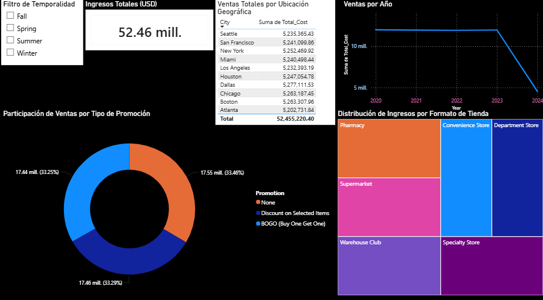

# 🛒 Retail Data Pipeline & Strategic Analytics (Microsoft Fabric)

## 📋 Resumen del Proyecto
Este proyecto demuestra la implementación de una arquitectura **Lakehouse End-to-End** utilizando la plataforma **Microsoft Fabric**. Se procesó un dataset de retail de **170MB** (cientos de miles de registros) recorriendo todo el ciclo de vida del dato: desde la ingesta de archivos crudos hasta la visualización de KPIs críticos para la toma de decisiones de negocio.

## 🛠️ Stack Tecnológico
* **Data Lake:** Azure OneLake (Arquitectura Medallion).
* **Procesamiento de Big Data:** PySpark (Notebooks de Microsoft Fabric).
* **Almacenamiento Inteligente:** Delta Tables (Formato optimizado para analítica).
* **Motor de Consultas:** Punto de conexión de análisis SQL.
* **Visualización:** Power BI con conexión **Direct Lake** (Alta velocidad y actualización en tiempo real).

## 🚀 Arquitectura del Pipeline
Implementé una arquitectura de tres capas para asegurar la calidad y escalabilidad de los datos:

1.  **Capa Bronze (Raw):** Almacenamiento del archivo CSV original en OneLake sin transformaciones.
2.  **Capa Silver (Cleansed):** Limpieza de esquemas, manejo de valores nulos, tipado de datos y estandarización de columnas mediante **PySpark**.
3.  **Capa Gold (Curated):** Creación de una tabla Delta optimizada y un modelo semántico listo para el consumo del negocio.

## 📊 Dashboard de Negocios
El informe final permite realizar un análisis multidimensional de la operación de retail:

* **Ventas por Ciudad:** Identificación de mercados líderes (Dallas, Boston).
* **Mix de Promociones:** Análisis de la dependencia de ofertas (BOGO vs Descuentos).
* **Performance por Formato:** Rentabilidad comparada entre Supermercados, Farmacias y Clubes de Almacén.
* **Interactividad:** Filtrado dinámico por temporadas (`Season`) y años mediante Slicers.

### 📥 Recursos del Proyecto
[**Descargar Informe Power BI (.pbix)**](./Dashboard%20Ejecutivo%20de%20Ventas%20Retail%20Análisis%20Multidimensional.pbix)

## 💡 Hallazgos Clave
* **Dependencia Promocional:** El 66% de los ingresos totales provienen de ventas bajo promoción (BOGO/Discount), sugiriendo una oportunidad de optimización en la fidelización de clientes orgánicos.
* **Equilibrio Geográfico:** Los ingresos están distribuidos de manera uniforme entre las ciudades principales (~$5.2M por ciudad), validando la integridad del procesamiento masivo de datos.

---
**Desarrollado por:** Bastian Soto Morales  
*Ingeniero Civil en Informática y Telecomunicaciones - Universidad Finis Terrae*
